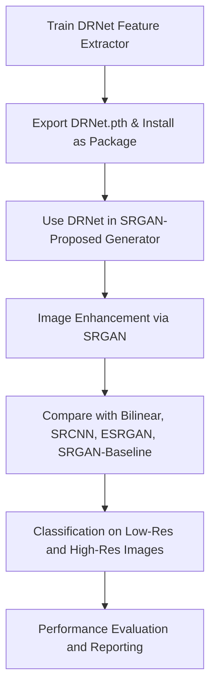

# Diabetic Retinopathy Analysis Project

Welcome to the **Diabetic Retinopathy Analysis Project** – a cutting-edge solution leveraging advanced deep learning techniques to detect and classify diabetic retinopathy with high precision. This pipeline integrates a custom DRNet architecture for domain-specific feature extraction, utilizes a modified SRGAN for retinal image enhancement, and concludes with a robust classification module to support clinical diagnostics at scale.

---

## Table of Contents

- [Overview](#overview)
- [Features](#features)
- [Architecture](#architecture)
- [Installation](#installation)
- [Usage](#usage)
- [Contributing](#contributing)
- [License](#license)
- [Contact](#contact)

---

## Overview

This project automates the detection and grading of diabetic retinopathy from retinal images using a multi-stage pipeline:

1. **Feature Extraction (DRNet):** A custom-built deep learning model, DRNet, is trained first to extract retinal features. It is exported as a reusable package and installed locally using `pip install -e .`.
2. **Image Super-Resolution (SRGAN-Proposed):** The DRNet model is then integrated as a feature extractor in a proposed SRGAN generator. While DRNet contributes to perceptual feature extraction, the remaining generator layers handle upsampling and image reconstruction.
3. **Comparative Benchmarking:** The SRGAN-proposed model is evaluated against other super-resolution baselines, including **Bilinear Interpolation**, **SRCNN**, **ESRGAN**, and a **baseline SRGAN**, using perceptual and structural metrics.
4. **Classification Module:** Finally, classification is performed on both low-resolution and high-resolution images to demonstrate the diagnostic uplift achieved through super-resolution.

---

## Features

- **Custom DRNet Architecture:** Purpose-built to learn domain-specific retinal features. Repackaged and installed as a pip-installable module.
- **Proposed SRGAN with DRNet Integration:** A modified SRGAN generator that embeds DRNet for high-quality feature preservation and refined image upsampling.
- **Baseline Comparisons:** Robust benchmarking against traditional and state-of-the-art super-resolution techniques.
- **Dual-Path Classification:** Performs disease grading on both original and super-resolved images to validate improvements in classification accuracy.
- **Modular and Scalable Pipeline:** Enables independent execution of DRNet training, SRGAN enhancement, and classification, promoting flexibility and reusability.
- **Automated Preprocessing and Evaluation:** Includes normalization, augmentation, and detailed model evaluation metrics including PSNR, SSIM, LPIPS, and vessel-based scoring.
- **Compliant and Secure:** Designed with healthcare-grade security and regulatory compliance in mind.

---

## Architecture

### Execution Flow Overview



### Modular Architecture Description

- **DRNet (Feature Extractor):** Trained separately on the APTOS dataset and installed using a local `setup.py`. Provides perceptual features to the SRGAN generator.
- **SRGAN-Proposed:** Incorporates DRNet feature maps and adds new upsampling and residual blocks for high-fidelity image reconstruction.
- **Baseline Models:** Used for comparative analysis—each model processes the same input images for fair performance evaluation.
- **Classification:** A CNN-based classification head is used to analyze both native and enhanced images, reporting performance deltas.

---

## Installation

### Prerequisites

- **Python 3.11+**
- **CUDA-enabled GPU** (recommended for training/inference)
- **PyTorch**

### Setup Steps

1. **Clone the Repository:**

   ```bash
   git clone https://github.com/nameishyam/code-implementation.git
   cd code-implementation
   ```

2. **Install DRNet as a Local Package:**

   ```bash
   pip install -e .
   ```

   This makes `DRNet` importable as a module in the SRGAN and classification pipelines.

3. **Create and Activate Virtual Environment:**

   ```bash
   python -m venv env
   source env/bin/activate  # On Windows: env\Scripts\activate
   ```

4. **Install Remaining Dependencies:**

   ```bash
   pip install -r requirements.txt
   ```

---

## Usage

### Step-by-Step Execution

1. **Train DRNet Feature Extractor:**(in drnet folder)

   ```bash
   python drnet.py
   ```

2. **Install DRNet Package Locally:**(in root)

   ```bash
   pip install -e .
   ```

3. **Run SRGAN-Proposed Training with DRNet Integration:**(in srgan-proposed folder)

   ```bash
   python code.py
   ```

4. **Generate Super-Resolved Images and Compare with Baselines:**(in root directory)

   ```bash
   python image-gen.py
   ```

5. **Run Classification on Both Image Sets:**

   ```bash
   python highres.py
   python lowres.py
   ```

   seperately for each dataeset and for each resolution (low and high)

---

## Contributing

We actively encourage innovation. If you'd like to enhance this solution:

- Fork the repo.
- Create a feature branch.
- Commit with clear messages.
- Submit a pull request.

Refer to our [Contributing Guidelines](CONTRIBUTING.md) for standards and review processes.

---

## License

Licensed under the [MIT License](LICENSE). You are free to use, distribute, and modify this software under its terms.

---

## Contact

For support, collaboration, or insights:

- **Email:** geddamgowtham4@gmail.com
- **GitHub:** [Diabetic Retinopathy Analysis Project](https://github.com/nameishyam/code-implementation)

---

Together, let’s revolutionize retinal diagnostics through AI-powered solutions that blend precision, scalability, and clinical relevance.
