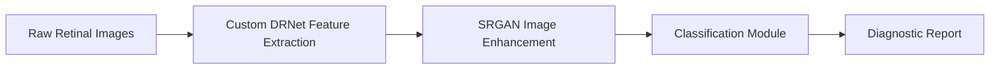

# Diabetic Retinopathy Analysis Project

Welcome to the **Diabetic Retinopathy Analysis Project** – a cutting-edge application that leverages state-of-the-art deep learning techniques to detect and classify diabetic retinopathy with precision and efficiency. This solution integrates a custom DRNet architecture, incorporating SRGAN for advanced image enhancement, and a robust classification module to deliver actionable insights for clinical decision-making.

---

## Table of Contents

- [Overview](#overview)
- [Features](#features)
- [Architecture](#architecture)
- [Installation](#installation)
- [Configuration](#configuration)
- [Usage](#usage)
- [Testing](#testing)
- [Deployment](#deployment)
- [Contributing](#contributing)
- [License](#license)
- [Contact](#contact)

---

## Overview

The Diabetic Retinopathy Analysis Project is designed to empower healthcare professionals by automating the screening and grading processes of diabetic retinopathy. The core of our system is the custom-built **DRNet** class, a tailored deep learning model that integrates the SRGAN framework for super-resolution enhancement, ensuring that even low-quality retinal images are optimized for accurate classification.

By fusing image super-resolution with state-of-the-art classification techniques, this project aims to streamline the diagnostic process, reduce manual intervention, and provide a scalable solution for large-scale screening initiatives.

---

## Features

- **Custom DRNet Architecture:** A bespoke deep learning model tailored to the specific challenges of retinal image analysis.
- **SRGAN Integration:** Utilizes Super Resolution Generative Adversarial Networks (SRGAN) to enhance image quality, yielding improved feature extraction and diagnostic accuracy.
- **Advanced Classification Module:** Implements a sophisticated classification pipeline for detecting and grading the severity of diabetic retinopathy.
- **Automated Preprocessing:** Includes data normalization, augmentation, and noise reduction to standardize and optimize incoming images.
- **Scalable and Modular Design:** Engineered for seamless integration into clinical workflows and adaptable for future enhancements.
- **Real-Time Analytics and Reporting:** Provides dynamic dashboards for monitoring screening progress and evaluating model performance.
- **Robust Security Measures:** Ensures that patient data is handled in strict accordance with HIPAA and other regulatory standards.

---

## Architecture

### DRNet Overview

- **Custom DRNet Class:** The backbone of our model, DRNet is engineered to balance depth and computational efficiency. It is designed specifically for medical imaging challenges, providing high accuracy in identifying subtle pathological features.
- **SRGAN Integration:** Preprocessing leverages SRGAN to significantly enhance the resolution of retinal images before they are processed by DRNet, enabling the model to capture finer details.
- **Classification Pipeline:** After super-resolution and feature extraction, the classification module categorizes images based on severity levels. The pipeline is modular, allowing for independent updates to individual components without disrupting the overall system.

### Flow Diagram



---

## Installation

### Prerequisites

Ensure your system meets the following requirements:

- **Python 3.8+**
- **CUDA-enabled GPU (optional, for enhanced training and inference performance)**
- **TensorFlow/PyTorch:** Depending on the model framework employed.
- **Node.js & npm (optional):** For running the associated frontend dashboard.
- **Database:** PostgreSQL or MySQL for persistent storage and logging.

### Setup Steps

1. **Clone the Repository:**

   ```bash
   git clone https://github.com/yourusername/diabetic-retinopathy-project.git
   cd diabetic-retinopathy-project
   ```

2. **Create a Virtual Environment:**

   ```bash
   python -m venv env
   source env/bin/activate  # Windows: env\Scripts\activate
   ```

3. **Install Python Dependencies:**

   ```bash
   pip install -r requirements.txt
   ```

4. **Install Frontend Dependencies (if applicable):**

   ```bash
   npm install
   ```

5. **Database Setup:**  
   Run the following command to initialize the database schema:
   ```bash
   python manage.py db upgrade
   ```

---

## Configuration

- **Config Files:** Adjust the settings in `config.yaml` or `config.json` for environment variables, database connections, and DRNet hyperparameters.
- **.env File:** Secure sensitive information such as API keys and database credentials. Refer to `.env.example` for guidance.

Ensure that all configurations are tailored to meet your operational and compliance requirements.

---

## Usage

### Running the Application

Start the application using:

```bash
python manage.py runserver
```

This command launches the web server and initiates the backend services for image processing and classification.

### System Interactions

- **Web Interface:** Access the diagnostic dashboard for real-time analytics, reporting, and model performance monitoring.
- **API Endpoints:** Use RESTful APIs to integrate with other systems. Consult the API documentation for detailed usage instructions.

---

## Testing

Robust testing is embedded within the project lifecycle:

- **Unit and Integration Tests:** Execute tests using:
  ```bash
  pytest --maxfail=1 --disable-warnings -q
  ```
- **Continuous Integration (CI):** Integrated with CI/CD pipelines to ensure code quality and model reliability.

---

## Deployment

For a smooth transition to production, consider the following steps:

- **Containerization:** Utilize Docker to create standardized deployment environments.
- **Cloud Integration:** Deploy on platforms like AWS, Azure, or Google Cloud to benefit from scalable infrastructure.
- **Monitoring and Logging:** Integrate with monitoring tools (e.g., Prometheus, Grafana) for real-time performance analysis and alerting.

---

## Contributing

We welcome forward-thinking contributors to help drive innovation. To contribute:

- Fork the repository.
- Create a feature branch for your enhancements.
- Commit your changes with clear, descriptive messages.
- Submit a pull request detailing your modifications.

Please review our [Contributing Guidelines](CONTRIBUTING.md) for further details.

---

## License

This project is licensed under the [MIT License](LICENSE). You are free to use, modify, and distribute this software in accordance with the license terms.

---

## Contact

For further inquiries or collaboration opportunities:

- **Email:** innovation@dranalysisproject.com
- **Website:** [www.dranalysisproject.com](https://www.dranalysisproject.com)
- **GitHub:** [Diabetic Retinopathy Analysis Project](https://github.com/yourusername/diabetic-retinopathy-project)

---

Embrace the future of healthcare diagnostics with the Diabetic Retinopathy Analysis Project. Together, we can drive innovation, elevate patient care, and enhance operational efficiencies in medical imaging.

```

```
